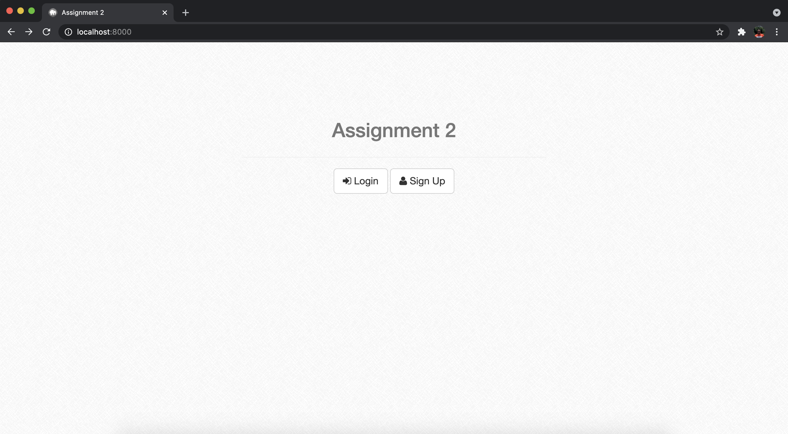
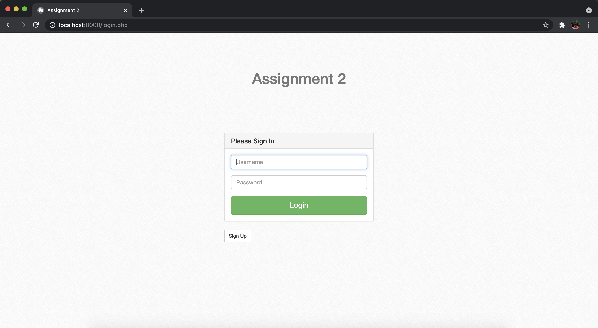
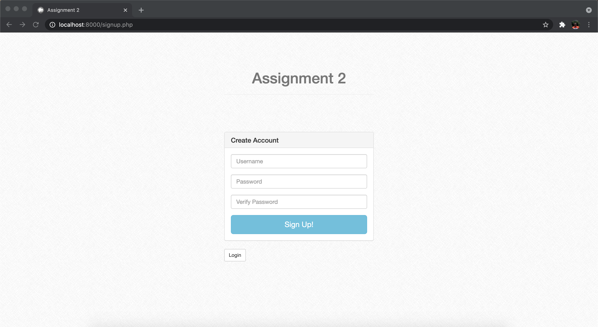
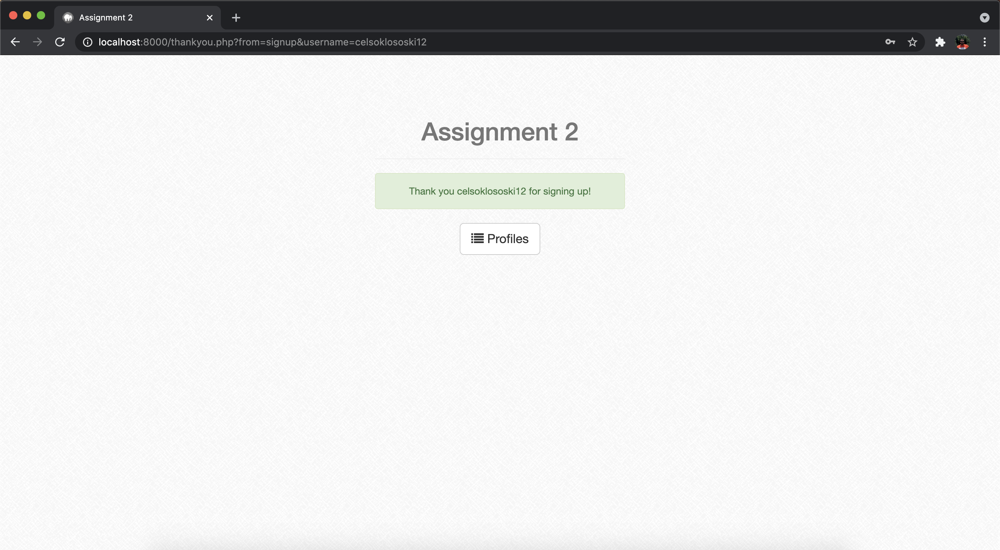
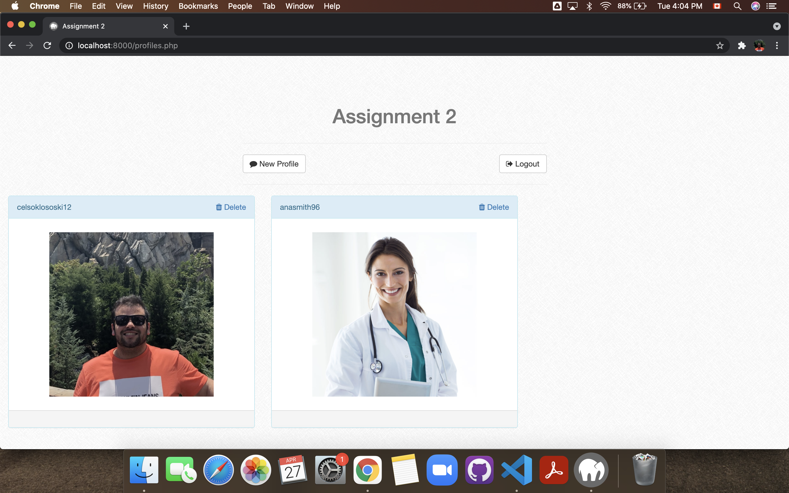

# PHP Project

Project developed during the PHP course that I took at BCIT (British Columbia Institute of Technology). The purpose of the project was create login/sign up page for a profiles page, where the user could insert profile images if the user was logged. The users can see the profile pictures from others users but they can only delete their own profile images. All the data from the this project is stored by a MySQL database.

